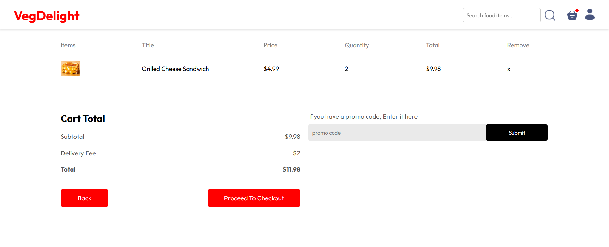

# VegDelight

**VegDelight** is a modern food ordering platform designed to showcase my skills in full-stack web development. The application includes a user-friendly frontend, a secure backend, and an admin panel for managing the system effectively.

---

## Key Features

### Frontend (React + Vite)
- **Responsive Design**: Fully optimized for mobile and desktop views.
- **Component-Based Architecture**: Modular and reusable components for ease of scalability.
- **Dynamic Features**:
  - Cart management for adding and removing items.
  - Authentication and user management for secure access.

### Admin Panel
- **Order Management**: View and update the status of customer orders.
- **Food Item Management**: Add and delete food items in the system.
- **Order Status Update**: Admins can change the order status and view order details.

### Backend (Node.js + Express)
- **Secure Authentication**: Token-based authentication using JSON Web Tokens (JWT).
- **Database Integration**: MongoDB for dynamic and hierarchical data storage.
- **Data Models**: Food items, orders, and users are structured using Mongoose schemas for efficient data handling.
- **File Handling**: Supports image uploads for food items.
- **Payment Integration**: Stripe integration for secure online payments.
- **Password Security**: Passwords are securely hashed using **bcrypt** before storing them in the database.

### Database (MongoDB)
- **MongoDB**: A NoSQL database, used to manage and query the application data efficiently.

---

## Technologies Used

### Frontend
- **React**: Component-based framework for building dynamic UIs.
- **Vite**: Fast and optimized build tool for modern web apps.
- **CSS**: Custom styling for a clean and intuitive interface.

### Backend
- **Node.js**: JavaScript runtime for server-side development.
- **Express**: Web framework for building APIs and server logic.
- **Mongoose**: ODM library for seamless interaction with MongoDB.
- **Stripe**: Payment gateway integration for secure online transactions.
- **bcrypt**: Password hashing for secure storage.

### Database
- **MongoDB**: Flexible NoSQL database for data storage and retrieval.

---

## How to Run Locally

1. **Clone the Repository**
    ```bash
    git clone https://github.com/your-username/vegdelight.git
    cd vegdelight
    ```

2. **Install Dependencies**
    - **Backend**:
      ```bash
      cd backend
      npm install
      ```
    - **Frontend**:
      ```bash
      cd frontend
      npm install
      ```
    - **Admin Panel**:
      ```bash
      cd admin
      npm install
      ```

3. **Configure Environment**

    Create a `.env` file in the **backend** directory:
    ```env
    MONGO_URI=mongodb+srv://<username>:<password>@cluster.mongodb.net/vegdelight
    JWT_SECRET=your_secret_key
    PORT=4000
    STRIPE_SECRET_KEY=your_stripe_secret_key
    ```

4. **Run the Application**
    - **Backend**:
      ```bash
      cd backend
      npm start
      ```
    - **Frontend**:
      ```bash
      cd frontend
      npm run dev
      ```
    - **Admin Panel**:
      ```bash
      cd admin
      npm run dev
      ```

---

## Project Highlights

### Admin Capabilities
- Admin panel for managing orders, and food items effectively.
- Ability to update order status and track user orders.

### Scalable and Modular Codebase
- Clear separation of concerns between frontend and backend components.
- Reusable components to ensure consistency in UI.

### Database Integration
- MongoDB handles user data, order details, and food items efficiently, ensuring fast queries and updates.

### Authentication and Security
- JWT-based authentication for secure user login and data access.
- Passwords are securely hashed with **bcrypt** to protect user data.

### Payment Integration
- Stripe integration allows users to securely pay for orders directly through the platform.

---

## VegDelight Screenshots (Click the images to see them bigger)

### Homepage
This section displays the homepage with the header, body, and footer.

<div style="display: flex; gap: 10px;">
    
    
    
    
</div>

### Sign Up Page
This section shows the sign-up page.

<div style="display: flex; gap: 10px;">
    
</div>

### Search Functionality
This section displays the search feature.

<div style="display: flex; gap: 10px;">
    
</div>

### Cart Details and Cart Total
This section shows the cart details, cart total, and option to add user's delivery info for order placement.

<div style="display: flex; gap: 10px;">
    
    
</div>

### Orders
This section displays the orders page.

<div style="display: flex; gap: 10px;">
    
</div>

### Admin Panel
This section showcases the Admin Panel with the add and delete functionalities, along with the ability to change the user's order status on the orders page.

<div style="display: flex; gap: 10px;">
    
    
    
</div>

---

## Skills Demonstrated
- **Full-stack Development**: Designed and developed both the frontend and backend of the application, ensuring seamless integration and user experience.
- **State Management & Dynamic UI**: Leveraged React and Context API for efficient state management and dynamic UI rendering, providing a responsive, interactive experience.
- **RESTful API Design & Integration**: Developed RESTful APIs for managing food items, user data, cart functionality, and orders, ensuring smooth client-server communication.
- **Database Schema Design**: Utilized MongoDB for efficient data storage and retrieval, with optimized schema design for managing users, orders, and food items.
- **Secure Authentication**: Implemented JWT-based authentication to ensure secure user login, authorization, and data access.
- **Payment Integration**: Integrated **Stripe** for secure payment processing, enabling users to pay for orders online.
- **Password Security**: Applied **bcrypt** for securely hashing passwords before storing them in the database.
